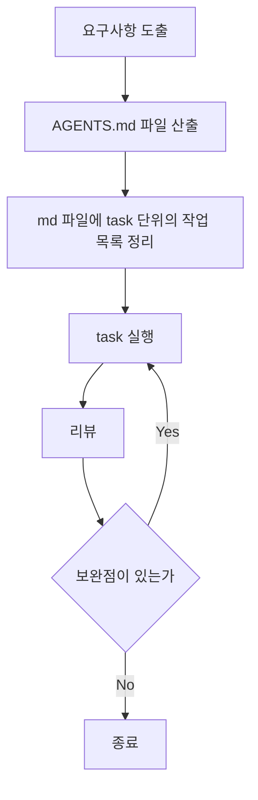

# AI Optimize Agent

프롬프트 optimizing을 위한 Kotlin + Spring Boot 프로젝트입니다.

## 프로젝트 목적

- 프롬프트 개선 작업을 자동화하여 업무 효율 및 성과를 증대시킵니다.

## 개발 프로세스

아래 순서를 기본 작업 루프로 사용합니다.



## 문서 작성 원칙

- LLM 컨텍스트는 제한적이므로, 문서는 간결하고 구조적으로 작성합니다.
- 단일 `.md` 파일이 길어지면 주제별로 분리합니다.
- 분리한 문서는 `INDEX.md`에서 색인해 빠르게 찾을 수 있게 합니다.

## 실행 방법

프로젝트 루트에서 아래 명령을 사용합니다.

```bash
./gradlew bootRun
./gradlew test
```

## LLM Provider 설정

- 지원 provider: `moonshot`, `openai`, `local`
- 기본 선택: `src/main/resources/application.properties`의 `app.llm.provider`
- provider별 `api-key`를 우선 사용하고, `app.llm.api-key`는 fallback으로만 동작합니다.
- OpenAI 사용 시 `app.llm.provider=openai`, `app.llm.openai.model=gpt-4o-mini`, `app.llm.openai.api-key`를 설정합니다.
- Moonshot 사용 시 `app.llm.provider=moonshot`, `app.llm.moonshot.api-key`를 설정합니다.
- Local 사용 시 `app.llm.local.base-url`, `app.llm.local.model`을 조정하고, 키가 필요한 게이트웨이일 때만 `app.llm.local.api-key`를 설정합니다.

## 프롬프트 히스토리

- `docs/prompt_history.md`에 기록됩니다.
